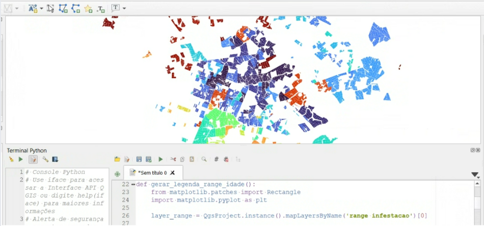

# 🗺️ **Automação de Dados para Mapas de Pragas Agrícolas**

## 🎯 **Problema de Negócio**
O processo manual de criação de mapas temáticos de infestação de cigarrinha era extremamente ineficiente, demandando várias horas por mapa e múltiplas ferramentas:

   **QGIS → SQL → Excel → Captura de tela → QGIS → Excel → volta para QGIS.**

Alto risco de erros humanos na digitação de valores, uso de planilhas erradas e tematização incorreta comprometiam a qualidade das análises para tomada de decisão agrícola.

## 🚀 **Solução Desenvolvida**

Criação de uma solução completa de automação que integra banco de dados PostgreSQL, QGIS e Python para automatizar todo o fluxo de produção de mapas temáticos de pragas agrícolas.
   
   **QGIS + PostgreSQL + Python = Pronto!**

### Arquitetura da Solução:

Modelagem de Dados: Banco PostgreSQL estruturado com JOINs automáticos entre dados de campo e base de talhões

Função PostgreSQL + Interface QGIS: Desenvolvimento de função SQL customizada consumida diretamente no QGIS para seleção parametrizada de datas, eliminando riscos de erro de período

Automação Python: Script integrado que executa:

• Extração e tratamento de dados do banco
• Cálculos de percentuais e hectares por range de infestação
• Geração automática de gráficos (meta vs realizado)
• Aplicação de estilos pré-definidos nas camadas
• Inserção automática de textos e datas no layout
• Preparação para exportação em PDF

Funcionalidades Avançadas:

Estilização automática de camadas (sem intervenção manual)
Seleção inteligente de dados do banco via script
Legendas dinâmicas com percentuais e hectares
Layout responsivo com gráficos integrados

## 📊 **Impacto Quantificado**

• Redução de Tempo: De várias horas → 10 minutos por mapa (redução de ~95%)
• Eliminação de Erros: Zero falhas humanas na digitação e tematização
• Processo Padronizado: Garantia de consistência entre diferentes mapas
• Produtividade: Capacidade de produzir múltiplos mapas no período que antes produzia-se apenas 1 
• Impacto Estratégico: Informações de pragas disponíveis para consulta a qualquer momento para gestão agrícola

## 🛠️ **Stack Tecnológica**

• **PostgreSQL:** Modelagem dimensional, ETL e validações estatísticas
• **QGIS:** Geoprocessamento com funções SQL personalizadas
• **Python:** Automação de gráficos, tematizações e layouts
• **Integração:** Scripts nativos QGIS para workflow completo

## 🔮 **Próximos Passos**

• Plugin QGIS: Interface amigável para consultas self-service
• Automação Completa: Envio automático por email para stakeholders
• Escalabilidade: Replicação para outros tipos de mapas temáticos

## 🏆 **Diferenciais Técnicos**

• Integração completa entre múltiplas tecnologias (PostgreSQL + QGIS + Python)
• Solução end-to-end que elimina intervenções manuais
• Arquitetura escalável para outros tipos de análises geoespaciais
• Foco em experiência do usuário final (setor parceiro)

## 🔒 **Nota:** 
**Projeto corporativo - código confidencial.**
**Metodologia e detalhes técnicos disponíveis para discussão.**
